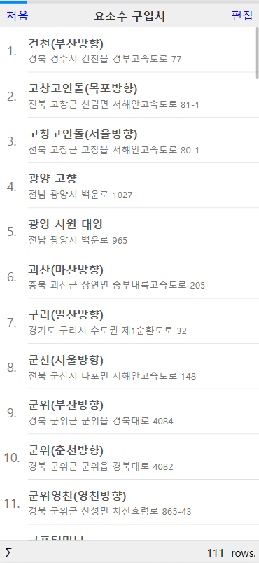

# RealGrid Touch Angular 예제

위 예제는 Angular와 RealGridTouch를 함께 사용하는 예제입니다.
> 현재 npm 배포가 되지않아, script파일을 import하는 방식으로 구현되어있습니다. 이는 추 후 변경될 예정입니다.


## 설치

```
$ git clone 
$ cd realgrid-touch-examples/
$ npm install
```

## 테스트

웹 브라우저 환경에서 직접 테스트 해보고 싶다면 아래처럼 작성하여 실행할 수 있습니다.

```
$ npm run start
```

<p align="center">
  
</p>
